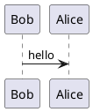

<h3 align="center">

<a href="https://pypi.org/project/mkdocs_puml/" target="_blank"></a>
<a href="https://pypistats.org/packages/mkdocs-puml" target="_blank"></a>
<br />
<a href="https://mikhailkravets.github.io/mkdocs_puml/" target="_blank"></a>
<a href="https://mikhailkravets.github.io/mkdocs_puml/themes/" target="_blank"></a>

</h3>

`mkdocs_puml` is a fast and simple package that brings plantuml diagrams to MkDocs
documentation.

## Quick Start

Run the following command to install the package

```shell
pip install mkdocs_puml
```

After that, add `plantuml` plugin into `plugins` section of your `mkdocs.yml` file,
in order to use PlantUML with MkDocs.

```yaml
plugins:
  - plantuml:
      puml_url: https://www.plantuml.com/plantuml/
```

Not include PlantUML code fences with `puml` keyword to your documentation, such as

~~~

~~~

That's it, `mkdocs_puml` will automatically build `SVG` diagrams from the code 🎉

For more information, please refer to the [**documentation**](https://mikhailkravets.github.io/mkdocs_puml/).

## License

This project is licensed under MIT license.
