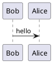

# MkDocs. PlantUML

`mkdocs_puml` package brings `puml` diagrams into `mkdocs` documentation.
It converts your inline puml diagrams into `svg` images.
This package has a markdown extension to be used in `mkdocs.yml`.

## Install

Run the following command to install this package

```shell
pip install mkdocs_puml
```

## How to use

To use puml with mkdocs, just add `mkdocs_puml.extensions` into
`markdown_extensions` block of your `mkdocs.yml` file.

```yaml
markdown_extensions:
    - mkdocs_puml.extensions:
        puml_url: https://www.plantuml.com/plantuml/
```

Now, you can put your puml diagrams into your `.md` documentation. For example,

<pre>
## PUML Diagram


</pre>

At the build phase `mkdocs` will send request to `puml_url` and substitute your
diagram with the inline `svg` image.
