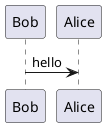

[](https://badge.fury.io/py/mkdocs_puml)
[](https://pypistats.org/packages/mkdocs-puml)

`mkdocs_puml` is a fast and simple package that brings plantuml diagrams to MkDocs
documentation.

## Install

Run the following command to install the package

```shell
pip install mkdocs_puml
```

## How to use

Just add `plantuml` plugin into `plugins` section of your `mkdocs.yml` file,
in order to use puml with mkdocs.

```yaml
plugins:
    - plantuml:
        puml_url: https://www.plantuml.com/plantuml/
```

`plantuml` plugin uses `PlantUML` exclusively as an HTTP service.
So, you should necessarily specify `puml_url` config.

The `plantuml` config with the full list of parameters is below

```yaml
plugins:
    - plantuml:
        puml_url: https://www.plantuml.com/plantuml/
        puml_keyword: puml
        verify_ssl: true
        verbose: true
        theme:
          enabled: true
          light: default/light
          dark: default/dark
          url: https://raw.githubusercontent.com/.../mkdocs_puml/.../themes/
        cache:
          backend: local
          local:
            path: "~/.cache/mkdocs_puml"
```

Where

| Parameter      | Type                   | Description                                                                 |
|----------------|------------------------|-----------------------------------------------------------------------------|
| `puml_url`     | `str`. Required        | URL to the PlantUML service                                                 |
| `puml_keyword` | `str`. Default `puml`  | The keyword for PlantUML code fence, i.e. \```puml \```                     |
| `verify_ssl`   | `bool`. Default `True` | Designates whether `requests` should verify SSL or not                      |
| `verbose`      | `bool`. Default `True` | Designates whether `mkdocs_puml` should print status messages to console    |
| `theme.enabled` | `bool`. Default `True` | Designates whether `plantuml` plugin should manage themes of the diagrams |
| `theme.light`  | `str`. Default `default/light` | Name of the theme to use when `mkdocs-material` is in light mode |
| `theme.dark`  | `str`. Default `default/dark` | Name of the theme to use when `mkdocs-material` is in dark mode |
| `theme.url`   | `str`. Defaults to this repository URL | URL to the repository folder where themes are located |
| `cache.backend` | `enum`. `disabled` or `local` | Specifies the storage to use for preserving diagrams |
| `cache.local.path` | `str` Defaults to `~/.cache/mkdocs_puml` | Defines path where `mkdocs_puml` stores diagrams |


Now, add PlantUML diagrams into your `.md` documentation. For example,

<pre>
## PUML Diagram


</pre>

At the build step `mkdocs` sends requests to `puml_url` and substitutes your
diagram with the `svg` images from the responses.

## Themes

`mkdocs_puml` integrates with
[mkdocs-material](https://squidfunk.github.io/mkdocs-material/) to display the diagrams
based on the selected light or dark mode. The plugin automatically includes the
configured theme into the first line of the PlantUML diagram (if it's not C4 diagram).
This allows developers to add custom styles to each diagram, which will take priority
over pre-defined themes.

In case of C4 diagrams, their styles are kept inside C4 library files. Since
`mkdocs_puml` themes contain styling of C4 as well, they will be included after
the last C4 library file. This way, it's **highly advised** to place C4
`!include` instructions at the top of the diagram.

### How to use themes

In order to configure themes you should add `theme` config as follows

```yml
theme:
  light: default/light
  dark: default/dark
```

- `light` specifies the theme to display on light mode
- `dark` specifies the theme to display on dark mode

Typically, a single theme has several flavors, allowing you to set the corresponding theme for each mode. For example, `default` theme has two flavors: `light` and `dark`.

By default `mkdocs_puml` uses themes from its GitHub repository. However, if you like
to use your own themes, you should set `url` attribute and themes from that url

```yml
theme:
  url: https://your.custom.puml/themes
  light: custom/light
  dark: custom/dark
```

`mkdocs_puml` then builds a special URLs to access themes that follows this format

```
{url}/{mode}.puml
```

For our example above, `mkdocs_puml` will include into PlantUML diagrams these URLs

- Light mode `https://your.custom.puml/themes/custom/light.puml`
- Dark mode `https://your.custom.puml/themes/custom/dark.puml`

Pay attention that for each PlantUML diagram, `mkdocs_puml` generates two `svg` images:
one for light mode and another for dark mode. If you want to disable theming and
generate one `svg` for each diagram, set `enabled` to `false` as follows

```yml
theme:
  enabled: false
```

If you like to know what themes are available or how to compose your own theme,
click on the link below.

🌗 [**Read more about theming in mkdocs_puml**](themes/README.md)

### Run PlantUML service with Docker

It is possible to run [plantuml/plantuml-server](https://hub.docker.com/r/plantuml/plantuml-server)
as a Docker container.

Add a new service to the `docker-compose.yml` file

```yaml
services:
  puml:
    image: plantuml/plantuml-server
    ports:
      - '8080:8080'
```

Then substitute `puml_url` config with the local URL in the `mkdocs.yml` file

```yaml
plugins:
    - plantuml:
        puml_url: http://127.0.0.1:8080
        num_workers: 8
```

Obviously, this approach works faster than
using remote [plantuml.com](https://www.plantuml.com/plantuml/).

### Standalone usage

You can use `PlantUML` converter without `mkdocs`. Below is the example,

```python
from mkdocs_puml.puml import PlantUML

puml_url = "https://www.plantuml.com/plantuml"

diagram1 = """
@startuml
Bob -> Alice : hello
@enduml
"""

diagram2 = """
@startuml
Jon -> Sansa : hello
@enduml
"""

puml = PlantUML(puml_url, num_workers=2)
svg_for_diag1, svg_for_diag2 = puml.translate([diagram1, diagram2])
```

## License

The project is licensed under [MIT license](LICENSE).
