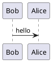

# MkDocs. PlantUML

[](https://badge.fury.io/py/mkdocs_puml)

`mkdocs_puml` package brings `puml` diagrams into `mkdocs` documentation.
It converts your inline puml diagrams into `svg` images.
This package has a markdown extension to be used in `mkdocs.yml`.

## Install

Run the following command to install this package

```shell
pip install mkdocs_puml
```

## How to use

To use puml with mkdocs, just add `mkdocs_puml.extensions` into
`markdown_extensions` block of your `mkdocs.yml` file.

```yaml
markdown_extensions:
    - mkdocs_puml.extensions:
        puml_url: https://www.plantuml.com/plantuml/
```

Where `puml_url` is URL to the `PlantUML` service.

Now, you can put your puml diagrams into your `.md` documentation. For example,

<pre>
## PUML Diagram


</pre>

At the build phase `mkdocs` will send request to `puml_url` and substitute your
diagram with the inline `svg` image.

### Connect PlantUML service with Docker

It is possible to run [plantuml/plantuml-server](https://hub.docker.com/r/plantuml/plantuml-server)
in Docker.

Either follow the instructions of the plantuml docker page or add a new service
to the `docker-compose.yml` file

```yaml
version: "3"
services:
  puml:
    image: plantuml/plantuml-server
    ports:
      - '8080:8080'
```

Then write the following instructions in your `mkdocs.yml` file

```yaml
markdown_extensions:
    - mkdocs_puml.extensions:
        puml_url: http://127.0.0.1:8080
```

Obviously, this approach works faster than
using [plantuml.com](https://www.plantuml.com/plantuml/).

### Use PlantUML converter directly

If you wish, you can use `PlantUML` converter on your own without `mkdocs`.
The example below shows how to do that.

```python
from mkdocs_puml.puml import PlantUML

puml_url = "https://www.plantuml.com/plantuml"

diagram = """
@startuml
Bob -> Alice : hello
@enduml
"""

puml = PlantUML(puml_url)
svg = puml.translate(diagram)
```

## How it works

The package uses `PlantUML` as a service via HTTP. So, it encodes the diagram into
a string that can be passed via URL. Then it sends GET request to
the `PlantUML` service and receives `svg` image containing the diagram.

The markdown extension just parses `.md` documentation files and looks for

<pre>
```puml

```
</pre>

code blocks.

**NOTE** you must set `puml` keyword as an indicator that the plant uml is located in the block.

After the page is parsed, `mkdocs_puml` extension encodes diagrams and
sends requests to `PlantUML` then substitutes `puml` diagram with the received `svg`
in the final `html` file.

Schematically, the overall process looks like

```mermaid
sequenceDiagram

participant mkdocs as MkDocs
participant mkdocs_puml as mkdocs_puml extension
participant puml as PlantUML Service

mkdocs ->>+ mkdocs_puml: Pass markdown to mkdocs_puml extension

mkdocs_puml ->> mkdocs_puml: Select all ```puml ``` blocks

loop For each puml diagram
    mkdocs_puml ->> mkdocs_puml: Encode diagram
    mkdocs_puml ->>+ puml: GET SVG diagram
    puml ->>- mkdocs_puml: SVG returned
    mkdocs_puml ->> mkdocs_puml: Save SVG
end

mkdocs_puml ->> mkdocs_puml: Substitute puml diagrams with corresponding SVG
mkdocs_puml ->>- mkdocs: Return updated md string
```

## License

The project is licensed under [MIT license](LICENSE).
