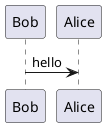

[](https://badge.fury.io/py/mkdocs_puml)

`mkdocs_puml` is a fast and simple package that brings plantuml diagrams into mkdocs
documentation.

## Install

Run the following command to install this package

```shell
pip install mkdocs_puml
```

## How to use

To use puml with mkdocs, just add `plantuml` plugin into
`plugins` block of your `mkdocs.yml` file.

`plantuml` plugin uses `PlantUML` only as http service. So, you should necessarily
specify `puml_url` config.

```yaml
plugins:
    - plantuml:
        puml_url: https://www.plantuml.com/plantuml/
        num_workers: 8
```

Where
* `puml_url` is URL to the plantuml service.
* `num_workers` is max amount of concurrent workers that requests plantuml service.

Now, you can put your puml diagrams into your `.md` documentation. For example,

<pre>
## PUML Diagram


</pre>

At the build phase `mkdocs` will send request to `puml_url` and substitute your
diagram with the `svg` images from the responses.

### Run PlantUML service with Docker

It is possible to run [plantuml/plantuml-server](https://hub.docker.com/r/plantuml/plantuml-server)
as a Docker container.

Add a new service to the `docker-compose.yml` file

```yaml
version: "3"
services:
  puml:
    image: plantuml/plantuml-server
    ports:
      - '8080:8080'
```

Then substitute `puml_url` setting with the local's one in the `mkdocs.yml` file

```yaml
plugins:
    - plantuml:
        puml_url: http://127.0.0.1:8080
        num_workers: 8
```

Obviously, this approach works faster than
using [plantuml.com](https://www.plantuml.com/plantuml/).

### Standalone usage

You can use `PlantUML` converter on your own without `mkdocs`.
The example below shows it.

```python
from mkdocs_puml.puml import PlantUML

puml_url = "https://www.plantuml.com/plantuml"

diagram1 = """
@startuml
Bob -> Alice : hello
@enduml
"""

diagram2 = """
@startuml
Jon -> Sansa : hello
@enduml
"""

puml = PlantUML(puml_url, num_worker=2)
svg_for_diag1, svg_for_diag2 = puml.translate([diagram1, diagram2])
```

## How it works

The package uses PlantUML as an HTTP service. It sends GET requests to
the PlantUML service and receives `svg` images representing the diagrams.

The `plantuml` plugin parses `.md` documentation files and looks for

<pre>
```puml

```
</pre>

code blocks. When `puml` code block is found it is saved to the buffer for
a later request of PlantUML service. In this step, we replace `puml` block
with the uuid in markdown file.

**NOTE** you must set `puml` keyword as an indicator that the plant uml
is located in the block.

After all pages are parsed, `plantuml` plugin requests PlantUML service
with the buffer of diagrams. After responses are received, the package
substitutes uuid codes in markdown files with the `svg` images.

## License

The project is licensed under [MIT license](LICENSE).

Diagram icon created by [Freepik](https://www.flaticon.com/free-icon/flow-chart_4411911?related_id=4411911&origin=search).
