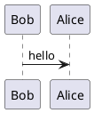

# Getting Started

Usage and connection of `mkdocs_puml` is as seamless as it gets.

## Installation

Install `mkdocs_puml` from PyPI

```
pip install mkdocs_puml
```

Then connect the plugin in `mkdocs.yml` file.

=== "Public PlantUML server"

    ```yaml
    plugins:
      - plantuml:
          puml_url: https://www.plantuml.com/plantuml/
    ```

=== "PlantUML server with Docker"
    Run [plantuml/plantuml-server](https://hub.docker.com/r/plantuml/plantuml-server) server
    with Docker:

    ```
    docker run -d -p 8080:8080 plantuml/plantuml-server:jetty
    ```

    Then pass the URL to the local server via `puml_url` parameter:

    ```yaml
    plugins:
      - plantuml:
          puml_url: http://127.0.0.1:8080
    ```

That's it, `mkdocs_puml` is ready to use :tada:

## Usage

Now, begin writing your documentation. `mkdocs_puml` will search all code fences
with `puml` keyword and replace them with actual diagrams.

???+ note "Set keyword"

    By default mkdocs_puml uses `puml` keyword. However, it can be changed with `puml_keyword` parameter.

    ```yaml
    plugins:
      - plantuml:
          puml_keyword: plantuml
    ```

For example, this code



will be rendered to


### Interact with diagram

As you may have already noticed, when you hover the diagram few buttons appear in the top
left corner:

- :octicons-copy-16: copies SVG content of the diagram.
- :octicons-plus-16: zooms in the diagram.
- :octicons-home-16: resets the diagram to its default view.
- :octicons-dash-16: zooms out the diagram.

Additionally, mouse events control the zooming and panning of the diagram:

- ++lbutton++ + `Mouse Move` will trigger panning of the diagram.
- ++shift++ + `Scroll` will trigger zooming of the diagram.

:cyclone: Try these actions for yourself!
