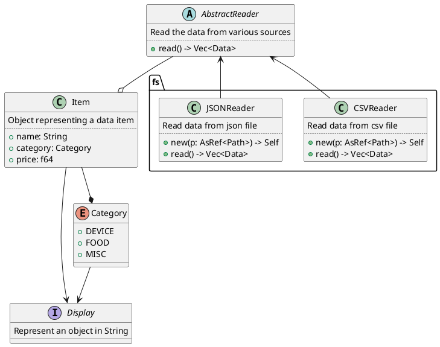

*`mkdocs_puml` is a fast and simple package that brings PlantUML diagrams to MkDocs
documentation.*

## Features

- **Interactive PlantUML Diagrams**: `mkdocs_puml` automatically converts PlantUML code
    into interactive `SVG` diagrams.
- **Themes Hub**: This project offers a collection of popular color schemes, such as
  *Catppuccin*, *Kanagawa*, and others, specially refined for PlantUML.
- **Automatic dark / light mode**: `mkdocs_puml` theming automatically adjusts a diagram's
  appearance whether you're on light or dark mode.
- **Seamless MkDocs Integration**: Easily integrate with MkDocs for fast and intuitive setup.

## Showcase

## Special Thanks

We would like to acknowledge the authors whose work, while not directly related to this project, has been instrumental in shaping it.

* [panzoom](https://github.com/timmywil/panzoom) is the library we use for
  diagrams interaction.
* [catppuccin](https://catppuccin.com/) provided a great color palette that
  we incorporated into one of our themes
* [lucide](https://lucide.dev/) offers a consistent collection of free SVG icons.

## License

This project is licensed under MIT license.
