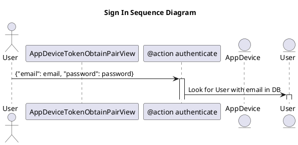
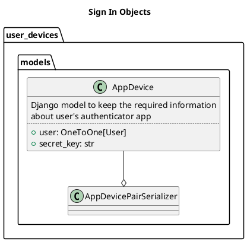
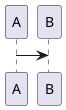

# Hello Plant UML

Here you see rendered svg diagram.



Text under diagram.

## The second diagram



## This is the third diagram using custom keyword



And here is just code

```python
print("Hello world")
```
