<h3 align="center">
	<br/>
	
	Catppuccin
	
</h3>

-----------------

[Catppuccin](https://catppuccin.com/) color palette for PlantUML diagrams.

## How to use

In order to use this theme with `mkdocs_puml`, set `theme` config of the plugin as follows:

```yml
theme:
    light: catppuccin/latte
    dark: catppuccin/mocha
```

## Flavors

All four flavors of [catppuccin](https://catppuccin.com/) are implemented for PlantUML
and C4 extension.

> ❕ A special `latte-white` flavor has been added, setting the base color to
> `#ffffff` instead of catppuccino's `#eff1f5`. Some users may find it more
> appealing when used with light mode.

|**cattpuccin/latte**|**cattpuccin/frappe**|
|:-------:|:--------:|
|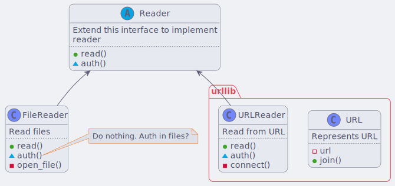|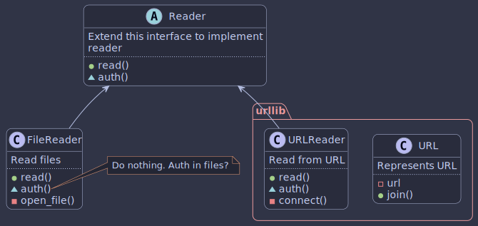|
|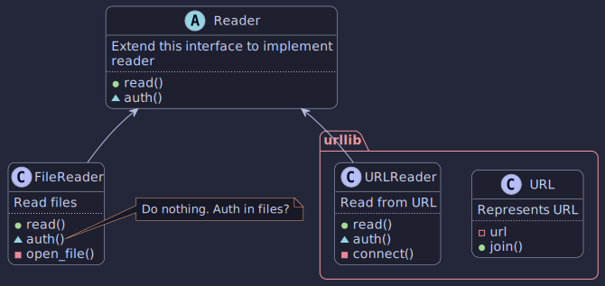|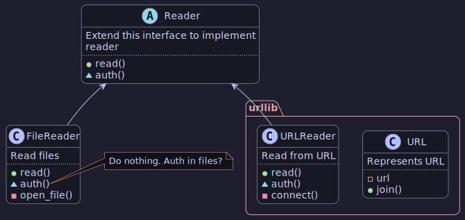|
|**cattpuccin/macchiato**|**cattpuccin/mocha**|

## Examples

Let's see how various diagrams look with this theme.

### Sequence

Simple sequence diagram looks as follows

|**cattpuccin/latte**|**cattpuccin/frappe**|
|:-------:|:--------:|
|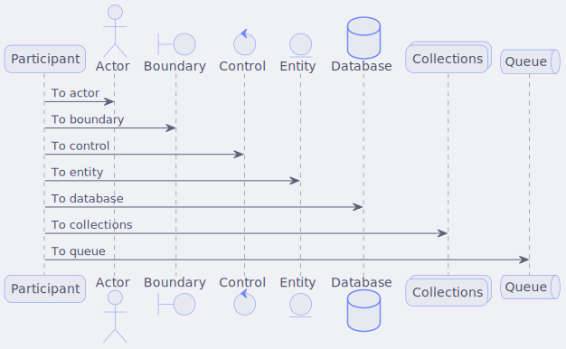|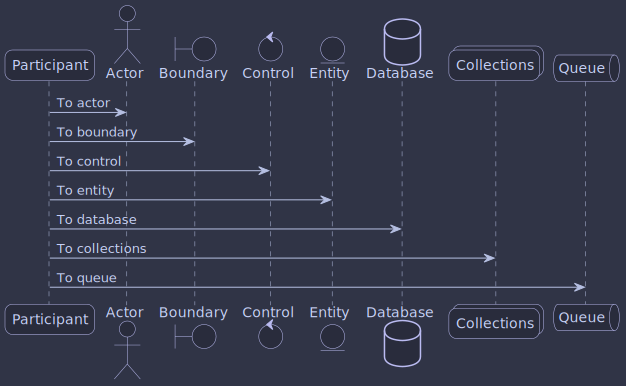|
|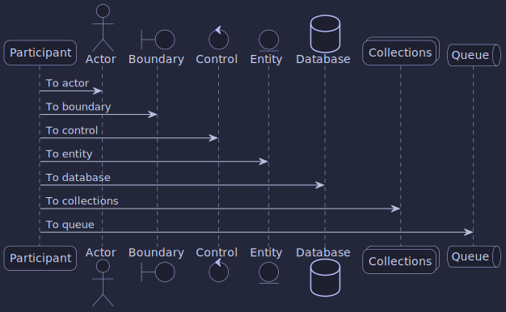|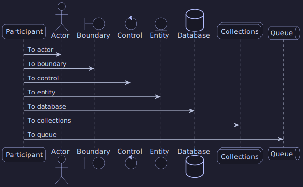|
|**cattpuccin/macchiato**|**cattpuccin/mocha**|

Sequence diagram with groups, notes, and dividers looks

|**cattpuccin/latte**|**cattpuccin/frappe**|
|:-------:|:--------:|
|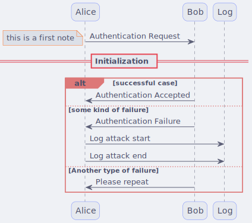|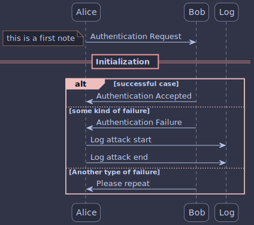|
|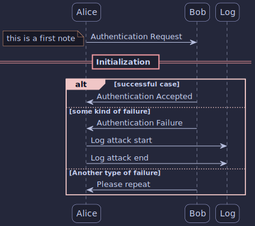|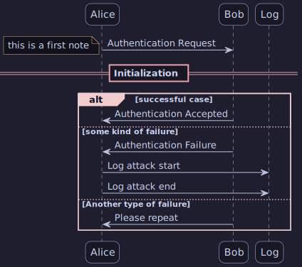|
|**cattpuccin/macchiato**|**cattpuccin/mocha**|

### Entities Diagram

|**cattpuccin/latte**|**cattpuccin/frappe**|
|:-------:|:--------:|
|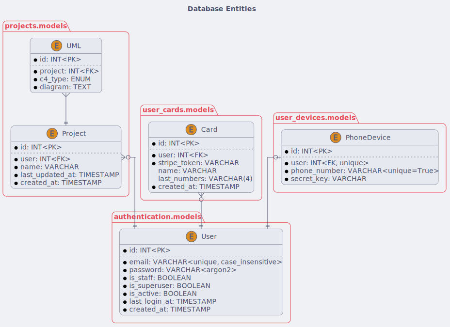|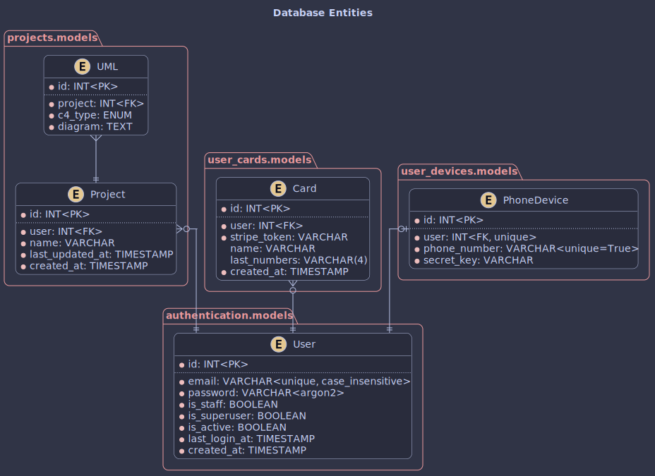|
||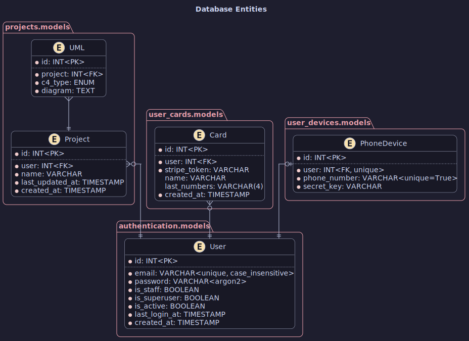|
|**cattpuccin/macchiato**|**cattpuccin/mocha**|

### Timing

|**cattpuccin/latte**|**cattpuccin/frappe**|
|:-------:|:--------:|
|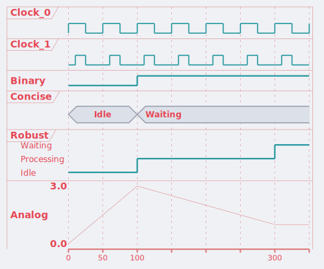||
|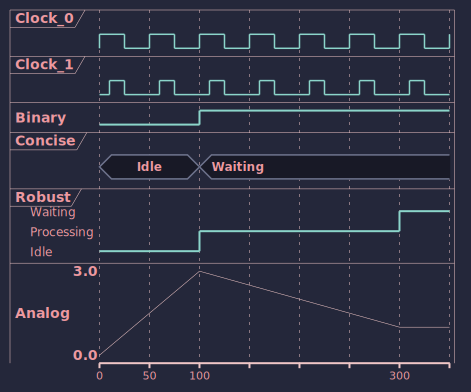|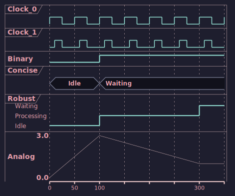|
|**cattpuccin/macchiato**|**cattpuccin/mocha**|

### C4

This theme also supports [C4-PlantUML](https://github.com/plantuml-stdlib/C4-PlantUML)
extension.

|**cattpuccin/latte**|**cattpuccin/frappe**|
|:-------:|:--------:|
|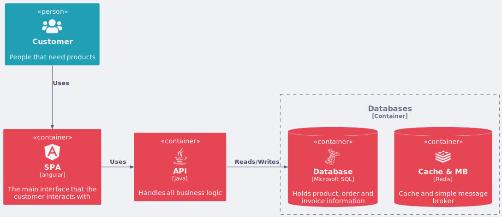|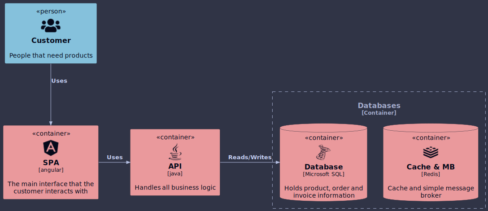|
|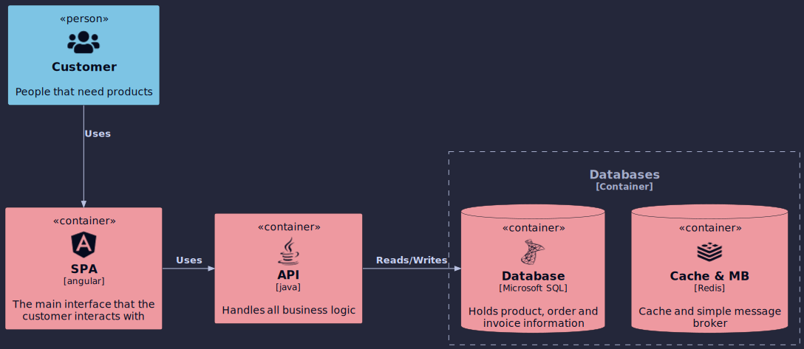|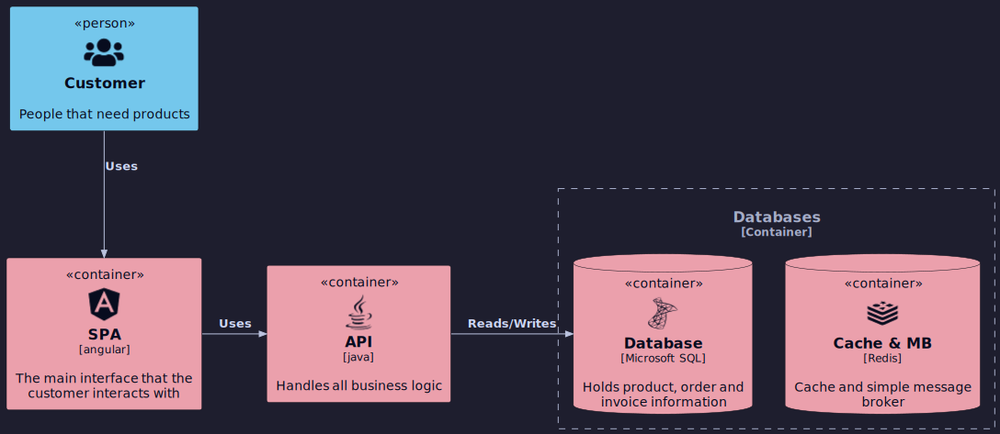|
|**cattpuccin/macchiato**|**cattpuccin/mocha**|
