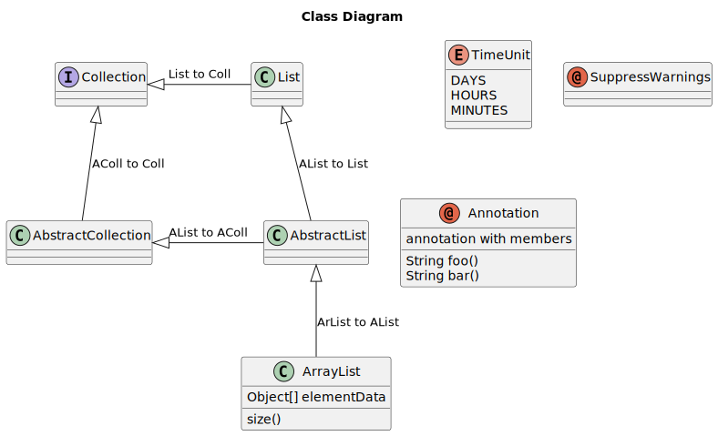
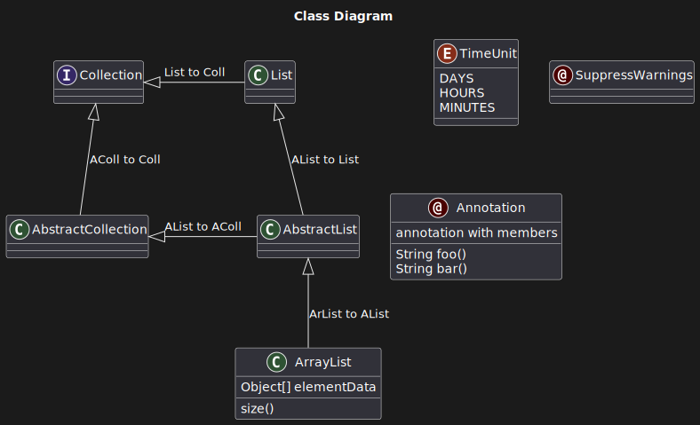
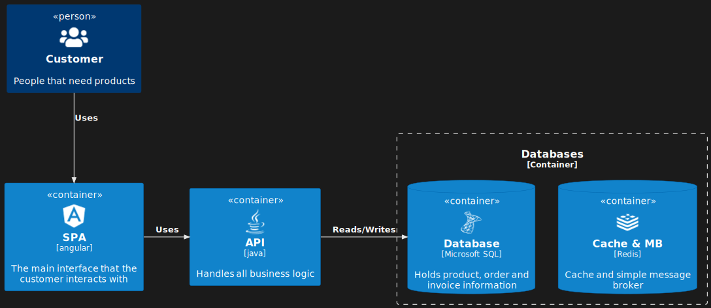

# Default PlantUML Theme

Default PlantUML theme that contains `light` and `dark` flavors.

|          **default/light**                   |            **default/dark**             |
|:--------------------------------------------:|:---------------------------------------:|
|      |   |

## How to use

In order to use this theme with `mkdocs_puml`, set `theme` config of the plugin as follows:

```yml
theme:
    light: default/light
    dark: default/dark
```

## Examples

This theme is actually identical to the default PlantUML theme, so there’s no need to replicate all the examples here. The only difference lies in C4.

### C4

This theme patches [C4-PlantUML](https://github.com/plantuml-stdlib/C4-PlantUML).
The `default/dark` flavor enhances the visibility of C4 diagrams. However, to make it
work, you should include `default/dark` after including all the `C4` code files.

[**c4_dark.puml**](examples/c4_dark.puml)

