<h3 align="center">


🌊 kanagawa 🌊
</h3>

-----------------

Kanagawa theme implements a color palette defined in [kanagawa.nvim](https://github.com/rebelot/kanagawa.nvim). This color scheme is inspired by Katsushika Hokusai’s work,
especially, his famous "The Great Wave".

## How to use

In order to use this theme with `mkdocs_puml`, set `theme` config of the plugin as follows:

```yml
theme:
    light: kanagawa/fuji
    dark: kanagawa/wave
```

## Flavors

This theme has two flavors

- `fuji` for light mode
- `wave` for dark mode

|**kanagawa/fuji**|**kanagawa/wave**|
|:-------:|:--------:|
|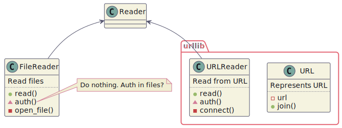|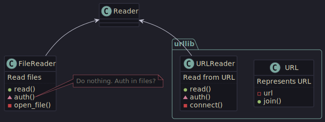|

## Examples

Let's take a look at some diagrams other diagrams with `kanagawa` theme.

### Sequence

|**kanagawa/fuji**|**kanagawa/wave**|
|:-------:|:--------:|
|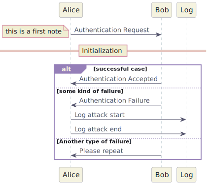|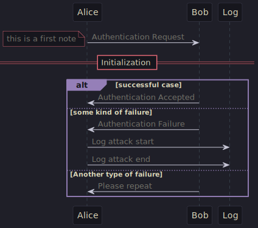|

### Activity

|**kanagawa/fuji**|**kanagawa/wave**|
|:-------:|:--------:|
|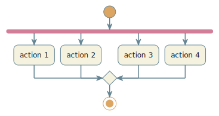|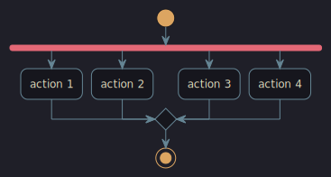|

### State

|**kanagawa/fuji**|**kanagawa/wave**|
|:-------:|:--------:|
|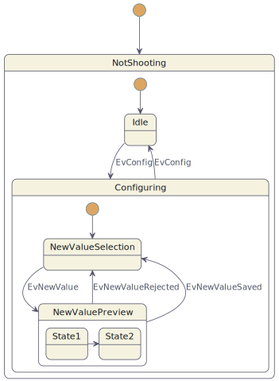|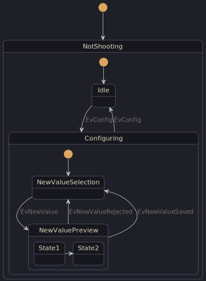|

### Entity

|**kanagawa/fuji**|**kanagawa/wave**|
|:-------:|:--------:|
|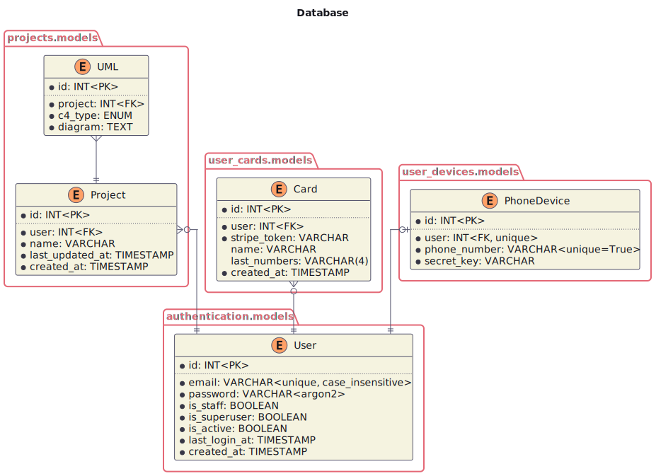|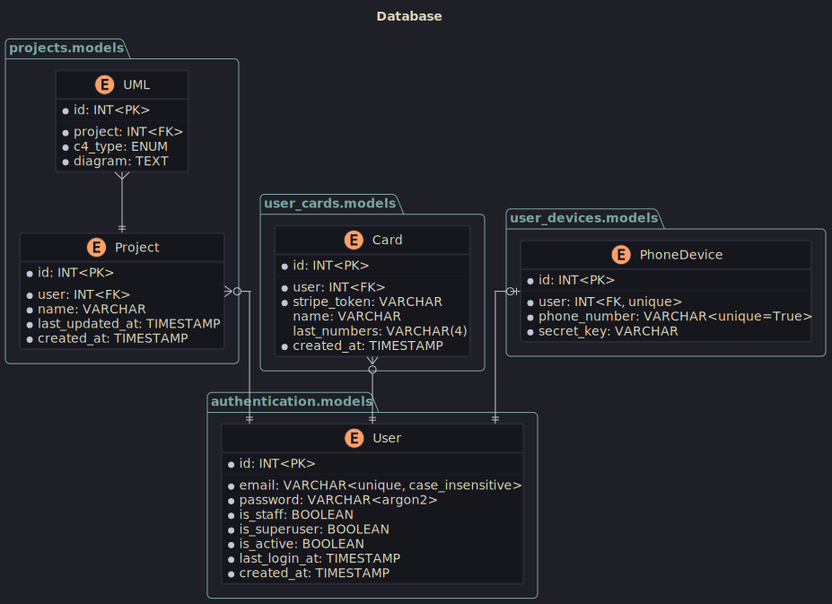|

### C4

|**kanagawa/fuji**|**kanagawa/wave**|
|:-------:|:--------:|
|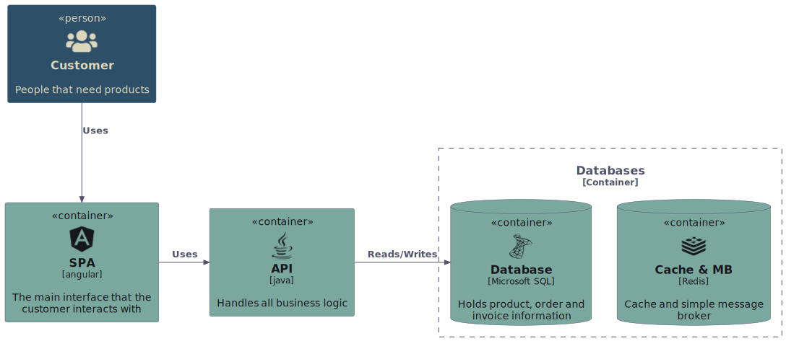|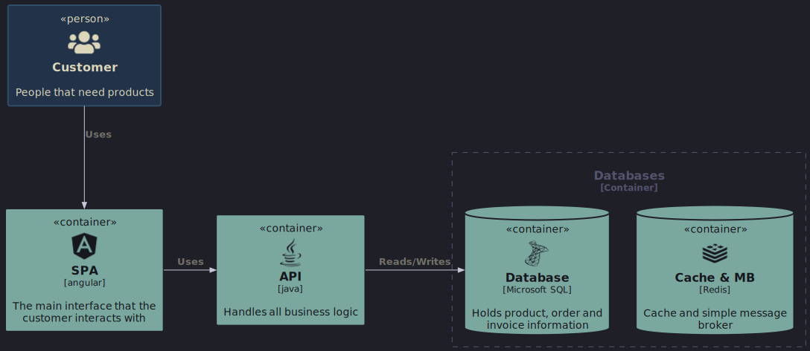|
