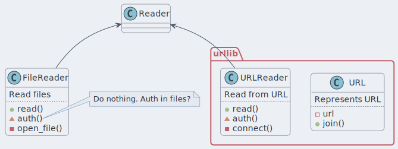
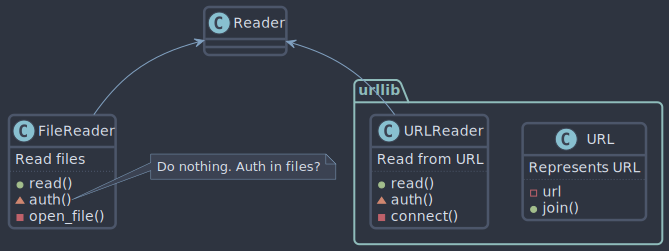
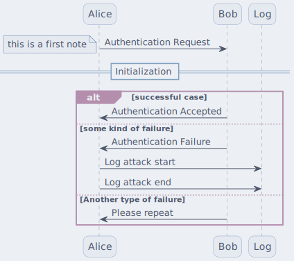
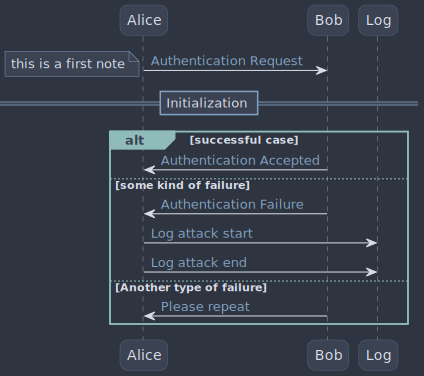
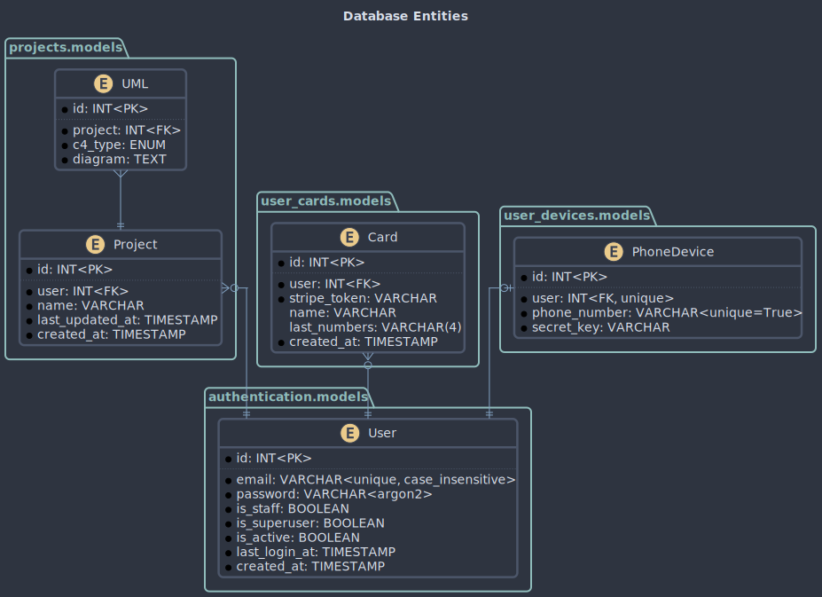
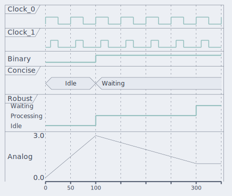
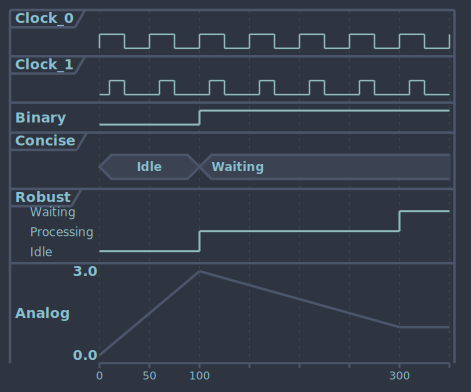
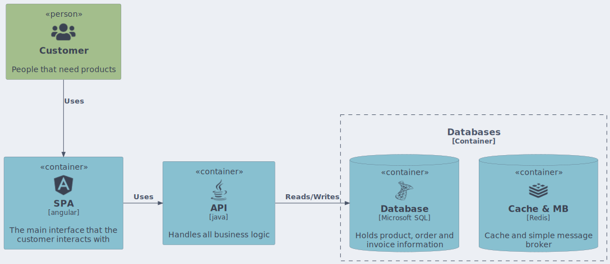
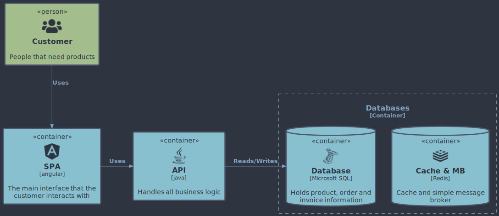

<h3 align="center">


Nord
</h3>

-----------------

[Nord](https://www.nordtheme.com) is a cold, minimalist color palette that
has been applied to PlantUML.

## How to use

In order to use this theme with `mkdocs_puml`, set `theme` config of the plugin as follows:

```yml
theme:
    light: nord/light
    dark: nord/dark
```

## Flavors

This theme comes in two flavors

- `day` for light mode
- `night` for dark mode

|**nord/day**|**nord/night**|
|:-------:|:--------:|
|||

## Examples

Below are some examples showcasing how this theme appears on various diagrams

## Sequence

|**nord/day**|**nord/night**|
|:-------:|:--------:|
|||

### Entity Diagram

|**nord/day**|**nord/night**|
|:-------:|:--------:|
|||

### Timing

|**nord/day**|**nord/night**|
|:-------:|:--------:|
|||

### C4

`Nord` theme contains styling of C4 diagrams

|**nord/day**|**nord/night**|
|:-------:|:--------:|
|||
